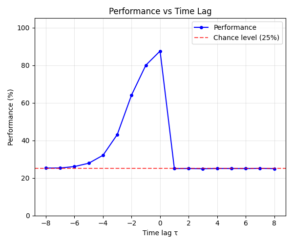
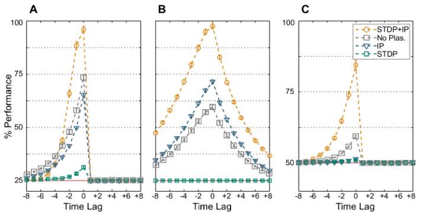
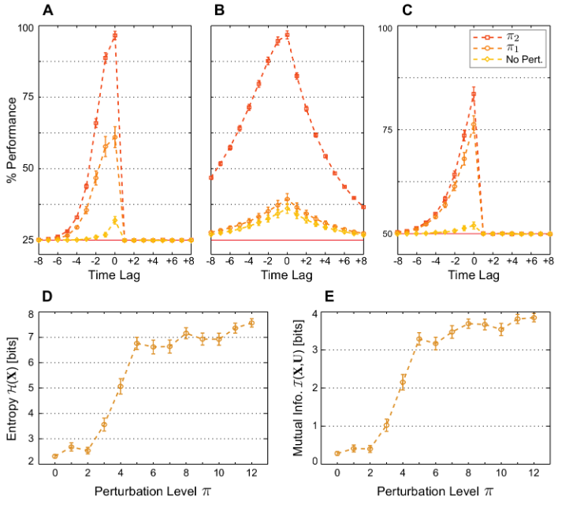
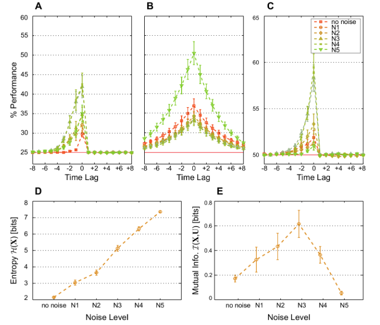

# Spatiotemporal Computations of an Excitable and Plastic Brain

Paper: 

**Toutounji, H. & Pipa, G. (2014).** *Spatiotemporal Computations of an Excitable and Plastic Brain: Neuronal Plasticity Leads to Noise-Robust and Noise-Constructive Computations.* PLoS Computational Biology, 10(3), e1003512. DOI: [10.1371/journal.pcbi.1003512](https://doi.org/10.1371/journal.pcbi.1003512)

## Overview

This folder contains a naive implementation exploring key results from the above paper. **A summary of the paper, its objectives, and main results, is found below.**

### Concepts explored

#### **Reservoir computing**
A **Recurring neural networks** with a **k-Winner-Take-All (kWTA)** mechanism, via:
$$x(t+1) = f(w \cdot x(t) - h + d(t))$$

The readout layer for the reservoir is trained with:
$$X_{tr} = \left\{ x(t)^T \right\}_{t_{pl} < t \leq t_{pl} + t_{tr}}$$

#### **Plasticity mechanisms**
- Spynaptic plasticity (STDP), updated with: 
$$\Delta w_{ij}(t+1) = \eta_{sp} \left[ x_j(t) \cdot x_i(t+1) - x_i(t) \cdot x_j(t+1) \right]$$
- Intrinsic plasticity (IP), updated with:
$$\Delta h_i(t+1) = \eta_{ip} \left( x_i(t+1) - k/n \right)$$

A full breakdown of the equations, as well as the code implementation, is provided in [RAND_SIP.ipynb](./notebooks/RAND_SIP.ipynb)

## Files summary

#### Notebooks
The juppyter notebook [RAND_SIP.ipynb](./notebooks/RAND_SIP.ipynb) provides a good way to start through the project's code. The file explores a full single variation from the various network types and tasks presented in the paper; namely, SIP network on RANDx4. Extra effort was put in ensuring the same methodologies and equations were used, through proper documentation/explanations.

#### Main files
[main.py](./main.py) launches a class-based batched version of RAND_SIP.ipynb. This allows us to run multiple network trials at once, effectively simulating the 100-network experiments used throughout the paper in a manageble time period.

## Implementation results

This figure is obtained from averaging 100 trials on the memory task RANDx4 with the SIP recurring network (utalizing both synaptic and intrinsic plasticity). This graph corresponds to the results shown in the original paper, particularly figures 2A and 4A. These figures are also shown below.

---

## Paper Summary

### What the paper is about

The paper addresses a core question in computational neuroscience: how do neurons in recurrent cortical networks learn to process stimuli that are extended in both space and time? The authors propose a geometric theory of how two common plasticity mechanisms, spike-timing-dependent synaptic plasticity (STDP) and intrinsic plasticity (IP), interact in recurrent networks to enable spatiotemporal computation.

The network model used is a k-Winner-Take-All (kWTA) recurrent network, analyzed as a nonautonomous dynamical system, meaning its attractor landscape shifts with the input rather than being fixed.

### Primary objectives

- Show that the combination of STDP and IP is necessary for learning useful neural representations of spatiotemporal inputs, with neither mechanism sufficient on its own
- Characterize the resulting neural code in terms of entropy and mutual information between network states and input sequences
- Demonstrate that the jointly plastic network exhibits two key properties with respect to noise: it tolerates noise (noise-robust), and in certain dynamic regimes it actually benefits from noise (noise-constructive), a form of stochastic resonance

### Key findings

- Networks trained with both STDP and IP (SIP-RNs) significantly outperform those trained with either mechanism alone on memory, prediction, and nonlinear computation tasks
- STDP alone drives the network into an input-insensitive regime, locking onto a minimal, low-entropy code; IP alone increases entropy but without synaptic structure, mutual information with the input remains low
- Together, STDP and IP produce a code that is both redundant and input-specific, the two properties identified as necessary for noise robustness
- Post-plasticity perturbation experiments reveal that the network has at least two dynamic regimes, and that larger perturbations (including noise) can push the system into the regime better suited for computation

> Figure 2. Average classification performance.
> 100 networks are trained by STDP and IP simultaneously (orange), IP alone (blue), STDP alone (green), or are nonplastic (gray). Optimal linear classifiers are then trained to perform (A) the memory task RAND x 4, (B) the prediction task Markov85, and (C) the nonlinear task Parity-3. marks chance level.

> Figure 4. Post-plasticity perturbation. 
> 100 networks are trained by STDP and IP simultaneously on (A) the memory task RAND x 4, (B) the prediction task Markov-85, and (C) the nonlinear task Parity-3 with increasing perturbation level: p~0 (yellow), p~4 (orange), and p~12 (red). Error bars indicate standard error of the mean. The red line marks chance level.

> Figure 7. Noise at certain levels is rendered constructive when synaptic and intrinsic plasticity interact. 
> Average classification performance of 100 networks trained with both STDP and IP on (A) the memory task RAND x 4, (B) the prediction task Markov-85, and (C) the nonlinear task Parity-3 for increasing levels of noise and no perturbation at the end of the plasticity phase (p~0). (D) Network state entropy H(X )and (E) the mutual information with the three most recent RAND x 4 inputs I(U,X ) at the end of the plasticity phase for different levels of noise. Values are averaged over 50 networks and estimated from 5000 samples for each network.
